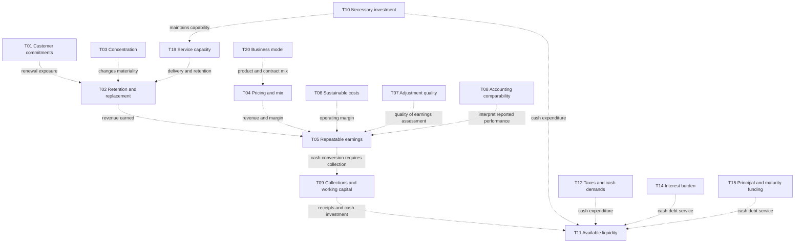
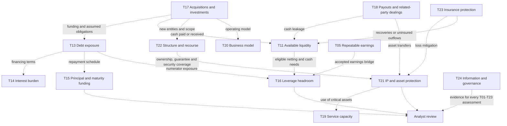
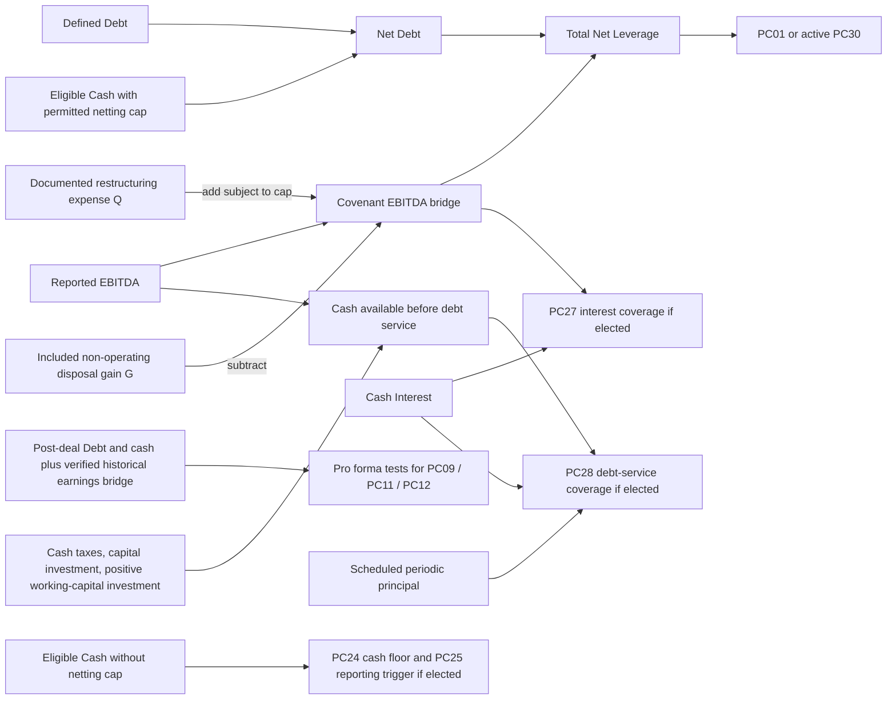
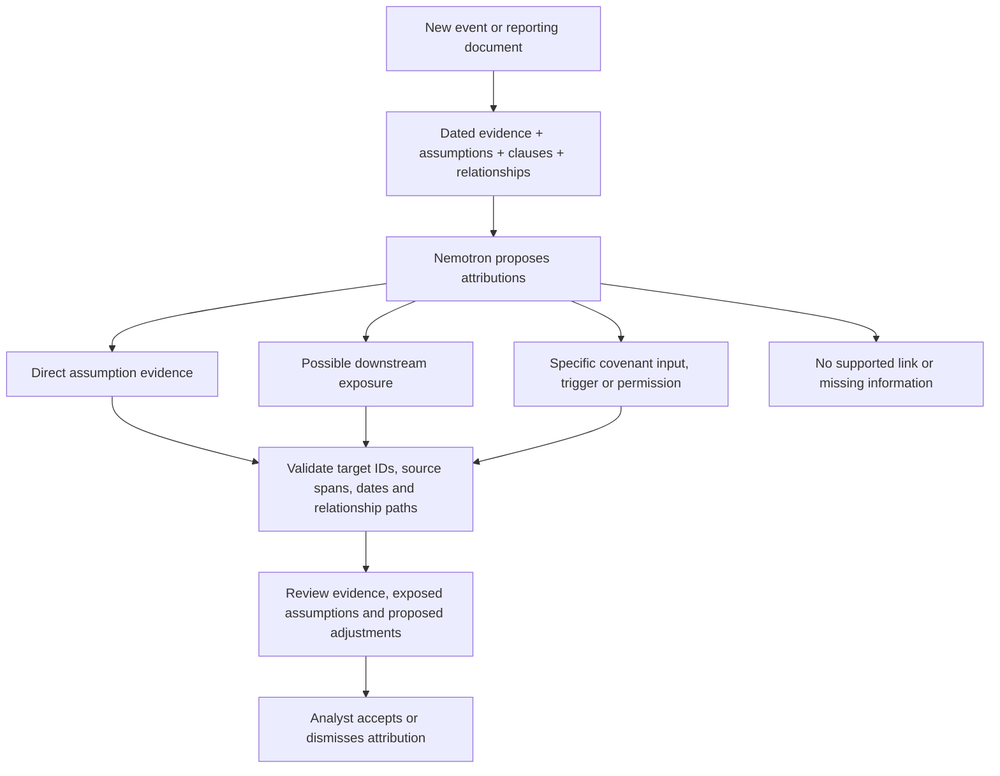

# RealityCheck: assumption register and relationship map

Prepared September 19, 2026. Scope: the fictional CedarBridge borrower and all 30 provisions in [Synthetic-Private-Credit-Covenants-30.md](Synthetic-Private-Credit-Covenants-30.md), library version 1.0. PC01–PC21 are core; PC22–PC30 are optional or alternative. Coverage of all 30 does not elect all 30 into one agreement.

This is a proposed analytical register used by the demo's event-attribution flow, not a finding that the assumptions are true or an executed agreement. It is not a complete deterministic covenant engine. The five broad thesis assumptions in the library are decomposed and extended into 24 proposed reviewable claims below. T01 restates a specific library claim; other rows elaborate the broad thesis and add review criteria rather than asserting that every detail already appears in an approved memo. Additional detail must be confirmed against the approved underwriting memo and borrower evidence before use. There is no universal list that covers every borrower or loan structure.

**The organizing rule:** evaluate new information against the approved thesis and against the contract in parallel. A thesis change can warrant review without causing a covenant failure. Conversely, a reporting or transaction covenant can fail while financial ratios remain healthy.

## 1. Three different kinds of objects

| Object | Purpose | Treatment |
| --- | --- | --- |
| **T01–T24: borrower assumptions** | Describe why the lender expects repayment and downside protection. | Assess as supported, weakened, contradicted, or insufficient evidence. Separately record credit implication and analyst action. |
| **V01–V12: evaluation prerequisites** | Establish whether the documents and facts permit a valid assessment. | Verify each relevant prerequisite; unresolved prerequisites block only dependent conclusions. They are not optimistic beliefs to assume true. |
| **PC01–PC30: contractual obligations** | Define actual formulas, restrictions, reporting duties, and remedies. | Apply the selected clause and its definitions. Do not invent a covenant from a thesis assumption or use a model to rewrite a contractual threshold. |

The existing application and the new clause library assign different meanings to A2–A5. This document uses T/V identifiers to avoid silently merging those versions. In the **30-clause library**, A1 is customer commitment; A2 is earnings quality; A3 is cash conversion; A4 is business and asset preservation; A5 is leverage and leakage. In the **older demo**, A2 is concentration, A3 leverage, A4 cash conversion, and A5 strategy. Reconcile sources explicitly before importing this register.

## 2. Borrower assumption register

All rows require a dated claim, source, approved baseline, materiality rule, and review owner. An illustrative concern below is a reason to investigate, not an automatic failure or model-derived loss. Mitigating evidence can improve the credit implication without restoring an original assumption that was contradicted.

### Revenue: T01–T04

| ID | Claim to evaluate | New evidence that challenges it | Evidence that can support or mitigate it | Primary covenant paths |
| --- | --- | --- | --- | --- |
| T01 | **Contracted customer commitments remain as underwritten.** Specifically, Atlas supplies 35% of revenue under a firm two-year commitment without termination for convenience, as stated in library A1. | Executed amendment adding cancellation, shorter commitment, reduced minimum purchases, or an actual termination/nonrenewal notice. | Operative contract and amendments; cancellation provision shown not to apply; an executed replacement contract may mitigate exposure. | PC08 only if its actual notice, customer-size, and officer-knowledge conditions occur; possible future earnings effects feed PC01, PC27, PC28, PC30. |
| T02 | **Retention, renewals, and replacement demand support the approved revenue forecast.** This is a proposed decomposition of A1, requiring borrower-specific confirmation. | Lost renewals, cancellations, reduced usage, nonbinding pipeline represented as contracted sales. | Signed renewals/replacements, delivered service, verified customer acceptance and collections; compare timing and margin as well as headline value. | Forecast content under PC05/PC25; conditional financial effects under PC01/PC27/PC28/PC30. There is no standalone churn covenant. |
| T03 | **Customer dependence remains within the concentration risk accepted at underwriting.** | A customer or controlled customer group becomes more dominant; supposedly diversified contracts share one controlling counterparty. | Customer-level revenue reconciled to consolidated revenue, control records, verified diversification and replacement capacity. | PC08 uses at least 20% of preceding-year revenue for notice applicability; this is not a concentration maximum. No 40% covenant is created from the older demo. |
| T04 | **Pricing, revenue mix, and contract economics support the forecast.** | Discounts, credits, variable usage replacing commitments, loss-making implementation work, or changed product mix. | Executed price terms, volume/margin bridge, profitable recurring services, evidence that a mix change improves economics. | Possible PC16 activity-scope issue; otherwise conditional earnings/cash effects. Services revenue is not automatically nonrecurring or prohibited. |

### Earnings: T05–T08

| ID | Claim to evaluate | New evidence that challenges it | Evidence that can support or mitigate it | Primary covenant paths |
| --- | --- | --- | --- | --- |
| T05 | **Reported operating earnings represent real, repeatable activity.** | Revenue reversals, unearned revenue recognition, non-operating gains, restatements, or unsupported balances. | Statement reconciliations, delivery/acceptance evidence, audit work, receipts, and explanations supported by records. | PC02–PC04/PC06/PC26 support evidence; accepted restatements and definition bridges can change PC01/PC27/PC28/PC30. |
| T06 | **Operating margins and the cost base remain sustainable.** | Wage/vendor inflation, customer concessions, recurring exceptional costs, gross-margin erosion. | Contracted cost reductions, demonstrated price recovery, volume/mix evidence, sensitivity cases with supported timing. | Conditional Reported EBITDA and cash effects; forecasts under PC05/PC25. No fixed margin covenant exists in this library. |
| T07 | **Underwriting reliance on EBITDA adjustments is justified by the underlying economics.** | Repeated restructuring, undocumented costs, double counting, projected synergies presented as realized earnings. | Original expense evidence, reconciliations, documented one-time nature and realized changes. | PC04 and the shared Covenant EBITDA bridge for PC01/PC09/PC11/PC12/PC27/PC30. Contractual eligibility is checked separately: an economically questionable item may still be permitted, and an attractive adjustment may be contractually excluded. |
| T08 | **Accounting and software capitalization allow meaningful period comparisons and do not hide deterioration.** | Expense capitalization changes, delayed amortization, changed revenue policy, or inconsistent treatment across periods/entities. | Closing-policy reconciliations, development-cost register, in-service dates, depreciation/amortization bridge, corrected comparable statements. | PC02/PC04 and all affected financial inputs; capitalized development cash also enters PC28/PC29 under the shared definitions. A policy change does not amend the agreement. |

### Cash: T09–T12

| ID | Claim to evaluate | New evidence that challenges it | Evidence that can support or mitigate it | Primary covenant paths |
| --- | --- | --- | --- | --- |
| T09 | **Customers pay and working-capital needs remain compatible with the cash forecast.** | Aged receivables, disputes, slower collection, increasing prepayments, or accelerated supplier payments. | Subsequent receipts, invoice terms, supported collection schedules, matched payable/receivable balances. | PC26 ageing disclosure; PC28 positive working-capital investment; observed cash may affect PC24/PC25 and leverage cash netting. An overdue receivable is not automatically an equal cash loss. |
| T10 | **Necessary capital investment can be funded while maintaining the product and service capacity.** | Unexpected platform rebuilds, equipment needs, capitalized development increases, or deferred essential maintenance. | Verified investment schedule, credible deferral/substitution, capacity and maintenance evidence, appropriate consent for restricted spending. | PC29 annual cash-spend cap; PC28 cash coverage; PC05 budgets. Budget approval is not lender consent. Lower spending can support near-term cash while weakening T19. |
| T11 | **Sufficient cash is actually available for debt service.** | Restricted/blocked deposits, cash at an ineligible entity, third-party claims, falling balances, funding intentions counted as cash. | Bank balances with ownership, location, currency, access and lien evidence; received and qualifying funding. | Direct defined input for PC01/PC09/PC11/PC12/PC24/PC25/PC30. The leverage netting cap and minimum-cash tests use different treatments. |
| T12 | **Taxes and other cash demands remain fundable without impairing operations or repayment.** | Tax assessments, payroll/vendor arrears, litigation payments, or contingent demands becoming payable. | Payments, supported cash forecasts, legitimate contest with all required protections, accepted settlements, qualifying insurance receipts. | PC18 and possibly PC10; PC28 cash taxes; other claims affect applicable inputs only when supported and correctly classified. No general litigation, payroll, or vendor-payment covenant is invented. |

### Debt and repayment: T13–T16

| ID | Claim to evaluate | New evidence that challenges it | Evidence that can support or mitigate it | Primary covenant paths |
| --- | --- | --- | --- | --- |
| T13 | **Debt and guarantee exposure remain understood, controlled, and within the underwritten capital structure.** | New leases, drawings, PIK accumulation, guarantees, seller financing, earnouts, or previously omitted obligations. | Complete debt/guarantee register, financing documents, repayments, authorized consents and defining amendments. | PC09 and PC23; defined Debt enters leverage tests and transaction permissions. An unfunded guarantee can require consent even when it is not a numerical Debt input. |
| T14 | **The cash interest burden remains serviceable under the agreed financing terms.** | Rate resets, hedge expiry, higher margins, commitment fees, unpaid cash interest, or prohibited changes to junior-debt terms. | Executed terms/hedges, lender statements, accrued-interest ledger, verified lower exposure and funded cash. | PC27 or PC28; PC23 payment/amendment restrictions. Unpaid cash interest remains included where contractually payable; PIK instead increases Debt. No unprovided term-loan rate is assumed. |
| T15 | **Scheduled principal and final maturity have credible funding sources.** | Amortization shortfall, finance-lease principal, unavailable refinancing, or maturity funding dependent on speculative sale proceeds. | Debt schedules, executed financing commitments and conditions, accumulated qualifying cash, credible asset-sale evidence. | PC28 includes scheduled periodic principal but excludes the final balloon; PC05 requires a maturity funding plan within 18 months of final maturity. Passing PC28 does not establish balloon repayment. |
| T16 | **Leverage headroom is adequate for the borrower's volatility and planned actions.** | Lower accepted earnings, more Debt, lost cash netting, or transactions consuming the cushion. | Reconciled current leverage, funded debt reduction, accepted earnings recovery, and separately labeled downside cases. | PC01 or PC30; tighter permission tests under PC09/PC11/PC12. A maintenance pass does not imply transaction permission. An internal review threshold must be approved separately. |

### Strategy and operations: T17–T20

| ID | Claim to evaluate | New evidence that challenges it | Evidence that can support or mitigate it | Primary covenant paths |
| --- | --- | --- | --- | --- |
| T17 | **Acquisitions and investments remain fundable and consistent with the accepted risk profile.** | Unrelated targets, insufficient post-deal cash, unsupported target earnings, hidden contingent consideration, or non-Loan-Party transfers. | Executed terms, historical target accounts, funding and pro forma bridges, permissions, and credible integration evidence. | PC09/PC12/PC13/PC16/PC20/PC21; PC22 if elected. Proposed deals warrant assessment without being treated as executed breaches. |
| T18 | **Distributions, affiliate dealings, and junior-debt payments leave adequate resources and lender protection.** | Cash leakage, unapproved buybacks, unfavorable sponsor charges, payment-blockage violations, or basket exhaustion. | Payment classification, remaining basket capacity, fair-value comparables, subordination terms, valid consents and post-payment liquidity. | PC11/PC13/PC22/PC23, plus defined cash/debt effects. A transaction may affect the thesis even if specifically permitted. |
| T19 | **People, systems, suppliers, and assets can continue delivering contracted services.** | Key departures, outages, vendor failure, cyber incidents, required-asset disposals, or underinvestment. | Restored capacity, tested continuity arrangements, retained expertise, substitute suppliers, operating and service-level evidence. | PC14 required-service-capacity exception; PC15/PC19/PC20 where relevant; otherwise possible effects on T02/T04/T06. There is no standalone key-person or uptime covenant. |
| T20 | **The business remains within the operating model and risk profile underwritten.** | Actual entry into an unrelated business, new operating model, or major shift in revenue and capital needs. | Product/customer/capability analysis showing relatedness, operational evidence, and any necessary prior consent. | PC16 and acquisition-related PC12. Activity within the permitted business may still weaken the original thesis. |

### Downside protection and evidence: T21–T24

| ID | Claim to evaluate | New evidence that challenges it | Evidence that can support or mitigate it | Primary covenant paths |
| --- | --- | --- | --- | --- |
| T21 | **Core IP and assets remain available to the business and support the expected lender recovery.** | IP transfers, exclusive licenses, competing liens, disposals, legal defects, or an asset-value decline. | Operative ownership/license records, lien searches, security evidence, valuations and proof that permitted transfers preserve protection. | PC10/PC14/PC15/PC20. A value decline can weaken recovery without changing a financial ratio or causing a covenant failure. |
| T22 | **Entity structure, guarantees, and collateral coverage preserve the expected recourse.** | New subsidiaries, delayed accession/perfection, dissolution, foreign entities, jurisdiction changes, or excluded subsidiary losses. | Ownership/control records, executed guarantees, filing/control receipts, survivor identity, consents and consolidated reporting. | PC17/PC20/PC21 and Group/Loan-Party scope in other clauses. Consolidation starts at control acquisition; it does not wait for accession. |
| T23 | **Insurance and risk-transfer arrangements provide the expected protection against operational loss.** | Lapsed coverage, excluded incidents, insufficient limits, excessive deductibles, missing endorsements, or delayed claims. | Policies and endorsements, continuous effective dates, premium evidence, claims acceptance and received proceeds. | PC19 coverage and certificate duties; potential T11/T19/T21 effects. A certificate alone does not prove uninterrupted coverage or claim payment. |
| T24 | **Management provides timely, reliable information and makes material facts available for review.** | Missing records, inconsistent certificates, inaccessible books, undisclosed policy changes, late customer/default notices, or misleading forecasts. | Complete records, reconciliations, independent corroboration, board approval, access logs, documented officer knowledge and receipt. | PC02–PC08/PC26 plus conditional PC25 and relevant supporting records throughout. This is an evidence dependency for every assumption, not proof of every assumption. |

**Baseline limits.** The library explicitly supplies Atlas's 35% starting exposure, the two-year commitment, and the numerical covenant definitions below. It does not supply universal churn, concentration, gross-margin, staffing, uptime, or forecast-error tolerances. Those remain proposed review criteria until the lender defines them. The older demo's 40% concentration trigger and 4.50x internal leverage trigger must not silently become current agreement terms.

The proposed decomposition connects back to the library's five original thesis claims as follows. Membership can overlap because, for example, necessary investment affects both cash generation and business preservation.

| Library thesis | Expanded review claims |
| --- | --- |
| A1 Customer commitment and revenue predictability | T01–T04; T19 provides operating context. |
| A2 Repeatable earnings and documented adjustments | T05–T08. |
| A3 Cash conversion and resources for debt service | T09–T12, T14–T15, T17–T18. |
| A4 Business, people, IP and asset preservation | T10, T17, T19–T23. |
| A5 Controlled leverage and leakage | T13–T18, T21–T22. |
| Evidence dependency across A1–A5 | T24 and all relevant V checks. |

## 3. Evaluation prerequisites: verify these for every relevant conclusion

| ID | Required check | What an unresolved check changes |
| --- | --- | --- |
| V01 | **Applicability:** selected profile, facility, clause, start date, measurement date, and activation conditions. | Record inactive or not yet due where established; unresolved applicability carries insufficient evidence. Do not label an unelected test passed. |
| V02 | **Operative contract:** correct executed agreement, definitions, amendments, scope, effective date, and authorized approvals. | Do not replace terms using a management label, draft amendment, or unsigned waiver. |
| V03 | **Entity and counterparty scope:** Group, Loan Party, control, customer-affiliate aggregation, ownership, consolidation and eliminations. | Do not reuse values across entities or treat a not-yet-acceded subsidiary as a Loan Party. |
| V04 | **Information timeline:** period covered, event date, effective date, available-at date, review date, and source version. | No future evidence in an earlier assessment. Reconstruct the then-known view; record later restatements separately. |
| V05 | **Source and authority:** authentic attributable document, exact quote/table locator, operative status, completeness, conflicts and counterevidence. | A quote proves traceability only. Keep interpretation/authority unresolved when support is insufficient. |
| V06 | **Event meaning:** actual versus proposed; granted right versus exercise; binding versus conditional/nonbinding; negation and exceptions. | Do not turn a proposed deal into an executed transaction or cancellation permission into a termination notice. |
| V07 | **Measurement comparability:** units, currency, periods, accounting basis, definition and reconciliation. | Keep Reported EBITDA, Covenant EBITDA, and analyst-normalized earnings separate; no mixed-period numerator/denominator. |
| V08 | **Evidence sufficiency and coverage:** all required inputs, populations, attachments and dated ledgers are available. | Missing is unknown, not zero, supported, or automatically breached. Independently evidenced reporting noncompliance can still be established. |
| V09 | **Calculation fidelity:** approved formula, sign, caps, exclusions, full precision, zero/negative denominator cases and anti-double-counting. | Recalculate only from accepted inputs; keep reported and accepted figures with reasons. |
| V10 | **Permission conditions:** transaction type, every relevant clause, remaining baskets, prior consent, and no-Default conditions where expressly required. | Permission under one clause does not waive another; no assumed basket replenishment or blanket no-Default rule. |
| V11 | **Clocks and delivery:** calendar versus Business Days, rollover, officer-knowledge evidence, agent notice, complete receipt and 5 p.m. New York cutoff. | Keep trigger, due date, actual receipt and remediation deadline distinct; measurement dates never roll. |
| V12 | **Resolution and facility rights:** initial result, Default, applicable F/R/A/X schedule, cure/remediation, waiver scope and affected lender class. | A later waiver does not erase history; an activated obligation is not already a failure; no automatic acceleration is inferred. |

## 4. Relationship map

**Dashed arrows indicate economic hypotheses or review dependencies. They do not propagate a numerical loss or a status automatically.** Solid arrows in the calculation map indicate approved formula dependencies. Direct contractual triggers are listed separately in section 7.

### 4.1 Operating and cash relationships



### 4.2 Financing, strategy, and protection relationships



### 4.3 From accepted facts to financial tests



The transaction node requires a fresh pro forma bridge for that transaction, not the unchanged maintenance ratio. PC27 and PC28 are alternative elections. Cash forecasts, valuation changes and customer events do not enter actual financial tests until they supply an accepted contractual input for the relevant period; scenarios remain separate.

### 4.4 Explicit relationship register

This table is the operational meaning of the maps. It supplies possible paths, not a calibrated causal model. “May” requires further evidence; no probability or magnitude is implied.

| Source | Target | Relationship and condition |
| --- | --- | --- |
| T01 | T02 | A weakened commitment may reduce retention certainty; an actual customer decision and timing determine the realized outcome. |
| T03 | T01, T02 | Concentration changes the materiality of the same contract or retention event; it does not change the clause's meaning. |
| T19 | T02, T04, T06 | Service disruption may reduce renewals, cause credits, and increase costs; contracts and incident evidence determine the scope. |
| T20 | T04, T06, T10 | A business-model change may alter revenue mix, costs and required investment. |
| T02, T04 | T05 | Retention/replacement and contract economics may change earned revenue and operating earnings. Account for recognition and timing. |
| T06 | T05 | Cost changes may change earnings; volume, fixed/variable costs and timing must be specified. |
| T07 | T05, T16 | Adjustment quality affects the economic interpretation of earnings; only allowed adjustments change Covenant EBITDA. |
| T08 | T05, T07, T10 | Accounting changes affect comparability and input classification; capitalization can alter reported measures without creating cash. |
| T05 | T09 | Earnings require collection before becoming cash; revenue recognition is not a bank receipt. |
| T09 | T11 | Working-capital investment uses cash; collections and releases affect liquidity when they occur. PC28 separately disallows uplift from a net working-capital release. |
| T10 | T11, T19 | Investment consumes cash and may sustain capacity. Lower spend can improve liquidity while undermining operations. |
| T12 | T11, T21 | Taxes and other cash demands may use liquidity; qualifying claims/liens may also affect asset protection. |
| T13 | T14, T15, T16 | Verified financing changes alter applicable interest/principal obligations and defined leverage inputs. |
| T14, T15 | T11 | Cash interest and principal payments consume liquidity; quantify from executed terms and schedules. |
| T11 | T16 | Only qualifying cash changes permitted netting; additional cash above the $10m cap gives no further leverage netting. |
| T17 | T13, T11, T20, T22 | Acquisitions can change financing, liquidity, business scope and entity structure. Verify each independently. |
| T17 | T05, T09, T10 | Acquisitions may add earnings, collection needs and investment needs; do not assume synergies or affordability. |
| T18 | T11, T13, T21 | Payouts/transfers can reduce cash, change junior Debt or move assets. Group eliminations and transaction substance matter. |
| T22 | T05, T13, T21 | Scope changes can alter consolidation, debt exposure and recourse even before accession is completed. |
| T21 | T19, T15 | Asset access supports operations; asset value and recovery can affect maturity funding. Do not equate book value with realizable proceeds. |
| T23 | T11, T19, T21 | Insurance may mitigate a loss after deductibles, exclusions, claim acceptance and payment timing; it does not prevent the event. |
| T16 | T17, T18 | Applicable pro forma leverage limits constrain specified acquisitions/dividends; maintenance compliance alone is insufficient permission. |
| T24 | T01–T23 | Reliable records support assessments. Missing or conflicting information reduces evidence sufficiency; it does not automatically contradict every economic claim. |

These relationships can create feedback over time. For example: collections weaken → cash falls → borrowing rises → interest expense increases → later cash weakens. Model each event and period separately; do not recursively invent new facts.

## 5. Coverage of every covenant

The T references identify the main thesis claims worth reviewing, not a substitute for the clause's inputs. V01–V12 apply whenever relevant. In particular, a direct contractual finding does not require first proving that a thesis assumption is false.

| Covenant | Profile | Main T claims | Direct contractual evaluation |
| --- | --- | --- | --- |
| PC01 Maximum net leverage | Core; omitted for REVOLVER | T05, T07, T08, T11, T13, T16, T22 | Quarter-end Total Net Leverage <= 5.00x, from March 31, 2027. |
| PC02 Quarterly statements | Core | T05, T08, T24 | Complete statements, comparatives, CFO certification and policy reconciliation within 45 calendar days; includes Q4. |
| PC03 Annual audit | Core | T05, T15, T24 | Required audit materials and CFO response within 90 calendar days, first year-end December 31, 2027; adverse opinion language alone does not fail delivery. |
| PC04 Compliance certificate | Core | T07, T08, T13, T16, T24 | CFO-signed calculations with thresholds/versions, reconciliations, adjustment and basket support within 45 calendar days; label inactive tests, disclose known noncompliance and attach claimed cure/waiver/amendment documents. Evaluate accuracy and underlying ratios separately. |
| PC05 Budget and forecast | Core | T02, T06, T09–T16, T24 | Board-approved annual package within 30 calendar days of year start; maturity funding plan when maturity is within 18 months. Targets are not financial covenants. |
| PC06 Books and inspection | Core | T05, T24 | Books plus valid requested access, five Business Days' notice, inspection-count rules and privilege conditions. |
| PC07 Noncompliance notice | Core | T24 and the affected T claims | Written notice within five Business Days of earliest proved Responsible Officer knowledge of actual noncompliance; do not wait for Event of Default. |
| PC08 Customer notice | Core | T01–T03, T09, T24 | Actual written termination/nonrenewal; customer and controlled affiliates >= 20% of preceding-year revenue; deliver the notice and summary of effective date, affected contracts, receivables and mitigation within five Business Days of officer knowledge. |
| PC09 Debt and guarantees | Core; REVOLVER modifies permissions | T13, T14, T16, T17, T18 | Permitted category, outstanding lease cap, pro forma leverage, required no-Default condition, prior consent and defining amendment as applicable. |
| PC10 Liens | Core | T11, T12, T13, T21 | Agent security or exact statutory/finance-lease exception; permitted debt does not authorize every lien. |
| PC11 Restricted payments | Core | T11, T16, T18 | External cash-dividend basket plus all cash, leverage and no-Default conditions; repurchases lack that basket permission. |
| PC12 Acquisitions | Core | T11, T16, T17, T20, T22 | Related business, full consideration basket, pro forma leverage, post-closing cash, no Default and other financing/accession duties. |
| PC13 Investments/advances | Core | T11, T17, T18, T22 | Check each executed transfer against exact exceptions or prior consent; no general dollar basket. |
| PC14 Asset disposals | Core | T10, T11, T19, T21 | Exact permitted category, fair-value annual equipment basket, exclusions, receipt and independently permitted use of proceeds. |
| PC15 Core IP | Core | T19, T21, T22 | Substance of ownership, exclusivity, security rights and recipient Loan Party status; no small-dollar exemption. |
| PC16 Business scope | Core | T04, T17, T20 | Actual activity relatedness or prior consent; permitted revenue mix changes do not automatically fail. |
| PC17 Existence/reorganization | Core | T20, T21, T22 | Existence, survivor, location, continued security/guarantees, permitted merger conditions and no Default. |
| PC18 Taxes | Core | T11, T12, T21 | Payment when due or every contest/reserve/stay condition; no general de minimis exemption. |
| PC19 Insurance | Core | T19, T21, T23, T24 | Continuous required coverage/limits/deductibles/endorsements; separately evaluate renewal certificate delivery. |
| PC20 Collateral | Core | T11, T21, T22 | Closing conditions; post-acquisition instruments within 15 Business Days and completed perfection within 30 calendar days. |
| PC21 Subsidiary guarantees | Core | T17, T21, T22 | Accession within ten Business Days and perfection within 30 calendar days from formation/control; foreign/unrestricted treatment requires consent and amendment. |
| PC22 Affiliate dealings | Optional GOVERNANCE | T17, T18, T24 | Fair terms; related transactions > $250,000/year also require disinterested approval and comparability memorandum; exact exemptions apply. |
| PC23 Subordinated debt | Optional GOVERNANCE | T11, T13–T15, T18 | Separate debt permission, subordination terms, blockage, no Default, payment type and prior consent where required. No opening junior balance or new debt capacity. |
| PC24 Minimum cash | Optional LIQUIDITY, with PC25 | T09–T15, T18 | Eligible Cash >= $5m at month-end, from January 31, 2027; no netting cap. |
| PC25 13-week forecast | Optional LIQUIDITY, with PC24 | T09–T15, T24 | Month-end Eligible Cash <= $8m activates a 91-day forecast due within five Business Days; each triggering month creates its own obligation. |
| PC26 Monthly reports | Optional MONTHLY | T05, T08, T09, T24 | Complete monthly/YTD package within 30 calendar days, including receivables > 90 days past contractual due date; does not replace quarterly duties automatically. |
| PC27 Interest coverage | Optional INTEREST; excludes PC28 | T05, T07, T08, T14 | Covenant EBITDA / Cash Interest >= 1.75x; same trailing four quarters, starting December 31, 2027. |
| PC28 Cash debt-service coverage | Optional CASH-COVERAGE; excludes PC27 | T05, T08–T10, T12, T14, T15 | Cash numerator / (Cash Interest + scheduled periodic principal) >= 1.10x; starting December 31, 2027. |
| PC29 Capital investment | Optional INVESTMENT | T08, T10, T11, T19 | Annual defined cash spend <= $4m, unless prior written consent; no rollover or proceeds offset. |
| PC30 Revolver leverage | Alternative REVOLVER; replaces PC01 | T05, T07, T08, T11, T13, T16, T22 | From March 31, 2027, quarter-end revolver utilization > 35% activates Total Net Leverage <= 5.00x; use all Group Debt and the specific facility-rights rules. |

PC27 and PC28 share the definition of Cash Interest even though only one covenant can be selected. PC30's price, availability conditions, and remedies require a completed scenario-specific facility schedule before actual draw events can be evaluated.

**Unresolved source wording for PC19:** the shared Material Collateral definition says it applies to PC10 and PC18, but PC19 also uses that capitalized term for property insurance. Record this as a V02 interpretation issue and resolve its scope before automating that part of PC19. It does not justify inventing a $500,000 exemption for PC20 or PC21, or blocking PC19's separately specified liability/cyber limits and certificate duties.

## 6. Approved calculation dependencies for this library

All amounts must match the entity, date/period, units and applicable agreement version. Dollar limits below are synthetic contractual choices, not market-standard assumptions.

Let R = Reported EBITDA; Q = documented cash restructuring expense deducted in R; G = non-operating disposal gains included in R; D = defined Debt; C = Eligible Cash. EBITDA periods are the applicable trailing four fiscal quarters.

```text
Permitted restructuring adjustment = min(Q, 0.10 × max(R, 0))
Covenant EBITDA E = R + permitted restructuring adjustment − G
Permitted cash netting = min(C, $10m, D)
Net Debt N = D − permitted cash netting
Total Net Leverage = N / E

If N > 0 and E <= 0: leverage fails.
If N = 0: leverage is defined as zero in this synthetic library.

PC01: Total Net Leverage <= 5.00x.
PC30: from March 31, 2027, activate only if quarter-end revolver drawn / commitment > 35%;
      when active, Total Net Leverage <= 5.00x.

PC27: E / Cash Interest >= 1.75x.
Cash Interest is floored at zero under the clause.
If Cash Interest = 0: pass only if E >= 0.

Operating working capital = trade receivables + prepaid operating expenses
                          − trade payables − accrued operating expenses
Positive working-capital investment W = max(0, period increase in that balance)
PC28 numerator = R − cash income taxes paid − Capital Investment − W
PC28 denominator = Cash Interest + scheduled periodic principal
PC28: numerator / denominator >= 1.10x.
If denominator = 0: pass only if numerator >= 0.
Do not include voluntary prepayments or the final maturity balloon.

PC24: month-end C >= $5m.
PC25: month-end C <= $8m activates forecast delivery; it is not a cash failure.
PC29: fiscal-year cumulative Capital Investment <= $4m absent prior consent.
```

Cash Interest includes amounts paid or payable in cash, including unpaid amounts due, commitment fees, and net hedge settlements once; it excludes financing-cost amortization and capitalized PIK. Capital Investment includes cash capitalized software development and excludes amounts already expensed in R and acquisition consideration handled by PC12. No double deduction is allowed.

For transaction tests, recompute the same leverage definition **after the proposed transaction and related transactions**, using the most recent ended quarter's historical earnings with accepted target/disposed-earnings adjustments. Exclude the debt being incurred's unspent proceeds from cash netting. Unsupported target earnings cannot establish permission. These are contractual pro forma tests, distinct from speculative downside forecasts.

| Transaction | Additional conjunctive conditions for the stated permission |
| --- | --- |
| PC09 new finance lease | All finance-lease principal outstanding <= $2m; pro forma leverage <= 4.50x; no continuing Default; PC10 lien scope. |
| PC11 external cash dividend | Annual cumulative cash dividends <= $1m; pro forma leverage <= 4.25x; post-payment Eligible Cash >= $8m; no continuing Default. |
| PC12 acquisition | Annual full consideration <= $5m; related business; pro forma leverage <= 4.50x; post-closing Eligible Cash >= $8m; no continuing Default; PC09 and other applicable restrictions/accession duties. |
| PC14 obsolete-equipment sale | Annual cumulative fair value <= $500,000; cash sale at fair value; no core IP, receivables, or assets required for contracted service capacity. Pay proceeds directly to a Loan Party account; later uses must independently comply. PC14 imposes no separate proceeds sweep or retention period. |

Annual baskets do not replenish after a repayment, sale or reversal of another event. The lease outstanding-principal basket releases capacity only through actual principal repayment. Consent can authorize only what its operative scope and approval authority cover.

## 7. Contractual relationships that can bypass the financial ratios

| Trigger/fact | Related obligation or permission | Required distinction |
| --- | --- | --- |
| Actual qualifying customer termination/nonrenewal notice | PC08 notice and exposure summary | A new cancellation right alone does not trigger it. |
| Actual noncompliance with an elected covenant + proved officer knowledge | PC07 notice | Notice can be due during remediation; the underlying noncompliance and notice noncompliance are separate. |
| Continuing Default | Express permission conditions in PC09/PC11/PC12/PC17/PC23; PC06 inspection-count rule | Apply only where stated. Default is not a universal prohibition on all ordinary activity. |
| Formation or control acquisition of a domestic subsidiary | PC21 guarantee and perfection clocks; consolidation begins immediately | Accession deadlines do not delay consolidation or authorize transfers prohibited by PC13/PC15. |
| Acquisition of an uncovered asset | PC20 execution/delivery and perfection clocks | Different deadlines and different evidence; a filing receipt is not interchangeable with a signed document. |
| Cash restriction, competing lien, or ownership change | Eligible Cash requalification; possibly PC10/PC20/PC21 | A remediation period does not preserve ineligible cash as an eligible input. |
| Month-end Eligible Cash <= $8m | PC25 reporting, if elected | At $7m, PC24's $5m floor passes while PC25 activates. Delivery can then be not yet due, satisfied, late, or insufficiently evidenced. |
| Quarter-end revolver utilization > 35% | PC30 leverage testing, if elected | Exactly 35% is inactive; do not net cash from drawn principal to determine utilization. |
| PC30 failure | Revolver financial Event of Default; shared Default for PC07 and express permission conditions | No term-loan Event of Default or acceleration solely by cross-default is created by this library. |
| Disposition producing a recognized non-operating gain | Covenant EBITDA gain exclusion plus PC14 permissions | A sale may add cash while removing earnings/assets. Do not count the gain as recurring covenant earnings. |
| New insurance period or coverage lapse | PC19 certificate/coverage duties and potentially PC07 | Restoration addresses the current condition without deleting the historical lapse. |

Financial failures use schedule F; reporting/access generally R; remediable affirmative duties A; unauthorized executed actions X. Clause-specific exceptions govern, including PC07/PC08 using A and PC19 separating coverage A from certificate delivery R. F/X do not gain the general reporting cure period. Record initial noncompliance even when an Event of Default has not yet arisen.

## 8. Worked paths for evaluating new information

### Contract change without an observed earnings decline

1. An operative amendment gives Atlas a 30-day cancellation right. Verify V02–V06.
2. T01 is contradicted if this conflicts with the applicable approved commitment. T02/T03/T05/T09/T11/T16 need targeted review, not automatic contradiction.
3. Without an actual written termination/nonrenewal notice, PC08 is untriggered.
4. If accepted Net Debt remains $80m and Covenant EBITDA $20m, current leverage remains 4.00x; PC01 passes at the applicable quarter-end.
5. A separate analyst-approved scenario with Covenant EBITDA $16m and Net Debt fixed at $80m produces 5.00x, which still passes the maximum. Below $16m it fails at that fixed numerator. The contract change alone does not justify selecting $16m.
6. An executed replacement agreement may mitigate the credit effect after considering amount, timing, margin and collectability. It does not reverse the historical change to Atlas's contract.

### Cash restriction with an immediate input effect

1. Opening bank cash is $10m. New accepted bank evidence shows $3m is restricted and unavailable for debt service at month-end.
2. Eligible Cash is $7m, not $10m. Assuming $90m Debt and $20m Covenant EBITDA at a matching quarter-end, leverage is ($90m − $7m) / $20m = 4.15x.
3. If LIQUIDITY is elected, PC24 passes at $7m and PC25 activates. This is neither a failed cash minimum nor an already-missed forecast.
4. Review T11 directly, T16 through its defined input, and PC10/PC20 if the restriction also supplies evidence relevant to those clauses.

### An acquisition that fits one basket but is not permitted

1. A proposed related acquisition costs $5m cash, with $10m opening Eligible Cash, no other cash inflow, and no prior acquisition usage.
2. The price can fit PC12's annual ceiling, but post-closing Eligible Cash would be $5m, below the required $8m.
3. Permission is not established even if pro forma leverage would pass. Assess T17/T11 and the funding alternatives separately.
4. A proposal is not a completed prohibited action. An execution lacking applicable permission is evaluated under PC12's schedule X. Do not infer that an unelected PC24 cash floor authorizes the acquisition.

## 9. Record to retain for each assessment

For each T claim, store: stable ID; exact approved claim and version; original source/locator; entity; horizon; criticality and approved review tolerance; supporting evidence; counterevidence; relevant V checks; status; credit implication; affected PC clauses; effect type; rationale; missing information; suggested action; and analyst acceptance/override with time and reason.

For each relationship, store: source and target IDs; type (`economic_dependency`, `materiality_modifier`, `evidence_dependency`, `formula_input`, `contractual_trigger`, or `permission_dependency`); scope and applicable dates; conditions; governing source; and approval state. Economic edges also need the additional inputs required to quantify a scenario. Avoid unvalidated numerical weights.

For each PC result, retain separately: applicability; evidence sufficiency; observed or contractual pro forma result; any separately modeled scenario; obligation/due date; initial noncompliance; resolution state; facility/lender class; source references; and analyst decision. Do not collapse all of these into a single red/green score.

## 10. Event-first Nemotron attribution

Confirmed September 19, 2026: on arrival of a new event, RealityCheck should ask Nemotron which company assumptions or individual covenants are affected, which assumptions are exposed to risk, and what adjustment needs analyst review. The user also requested implementation in the demo.



**Trigger and scope.** The application receives an event description or a parsed document and submits its source text to Nemotron. The model does not independently observe company events. The demo analyzes newly submitted text immediately on submission and offers attribution for the selected reporting packet. Parsed uploads enter the same flow. All 24 working assumptions and 30 covenant definitions are available for matching; only clauses selected by the review's profile can be treated as active. The model receives the shared contract definitions, relevant source text, and explicit relationship catalog. It never receives the separate evaluator answer file.

**Attribution is many-to-many.** An event can directly affect T01, create downstream exposure to T02/T05/T11/T16, and be relevant to PC08/PC01. A covenant finding need not pass through a thesis assumption first. For every link, explain what in the event supports the link, what is merely conditional, and which evidence is missing.

**Six relation types:** direct assumption evidence; downstream exposure; covenant input; covenant trigger; covenant permission; evidence gap. Each attribution names a target and version, effect type, risk direction, rationale, exact evidence and counterevidence, missing information, suggested action, and proposed adjustment. Downstream links include a path through known relationships and cannot automatically assign the endpoint a contradicted status. Newly proposed relationships or assumptions belong in a separate candidate list until reviewed.

**Coverage is separate from status.** A new event that does not address T05 leaves T05 unaddressed by this event; it does not establish that T05 is supported or erase an earlier assessment. Store event-level proposals separately from the approved baseline. The expanded T register is working analytical material, not 24 independently approved lender claims. Label its baseline status accordingly.

**Adjustment means a proposal.** Nemotron can suggest revisiting wording, replacing a forecast input after obtaining evidence, collecting information, or testing a downside case. Accepting an attribution records the analyst's review; it does not silently rewrite the approved thesis, contractual formula, or threshold. A later baseline revision must retain its original claim, approval, version and effective date.

**Contract output is review support.** Nemotron proposes clause relevance, predicate interpretations and inputs. Its prose is not a final numerical covenant determination. Existing deterministic calculations remain independently available. The event-attribution implementation does not claim to execute every provision in the 30-clause authoring library.

**Unavailable or invalid results remain explicit.** If Nemotron is unavailable, the event stays unassessed. Do not label keyword routing or a stored example as a Nemotron answer. Unknown target IDs, invalid source locators/quotes, future-unavailable evidence, inactive-clause claims, and unsupported relationship paths cannot be published as verified findings. Event text is evidence, never an instruction to the model.

For the Atlas cancellation-right example: directly review T01; identify conditional exposure to retention, earnings, liquidity and headroom; explain why PC08 still needs an actual termination/nonrenewal notice; request the facts needed to quantify any forecast change. The model must not manufacture a customer loss or a leverage failure.

## 11. Sources and status

- Governing reference for this register: the Markdown [30-covenant library](Synthetic-Private-Credit-Covenants-30.md), version 1.0, read September 19, 2026. The [JSON companion](Synthetic-Private-Credit-Covenants-30.json) is an import representation; any divergence must be reconciled to that reference before use. These source artifacts remain unchanged by this document.
- Product assessment structure: [RealityCheck master plan](RealityCheck.md), sections 5–9. Economic links here are proposed analytical relationships; they do not add contractual requirements.
- Existing prototype assumptions: [demo data](realitycheck/data.py), cited to flag the A1–A5 identifier conflict and existing internal review thresholds. The new event flow uses the separate T01–T24 [runtime register](realitycheck/assumption_registry.json); original packet reviews retain their A1–A5 meanings. See the [demo guide](realitycheck/README.md) for submission and review behavior.
- General analytical context: [OCC, Rating Credit Risk](https://www.occ.treas.gov/publications-and-resources/publications/comptrollers-handbook/files/rating-credit-risk/pub-ch-rating-credit-risk.pdf), printed pp. 3–5 and 24–25, describes both objective and qualitative factors, repayment capacity and structural protection. This does not validate CedarBridge's synthetic thresholds or establish performance of RealityCheck.

The complete coverage claim is limited to the 30 specified provisions and their shared definitions. Individual evidence packets, additional agreement terms, and lender-approved materiality criteria can require additional assumptions. No current borrower status, real-world performance, or legal enforceability finding is asserted here.
